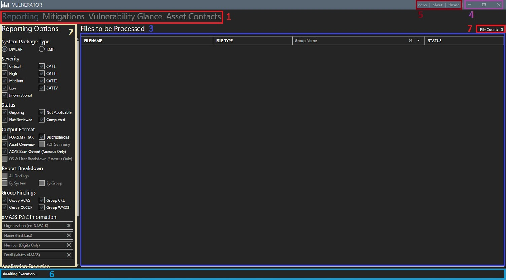
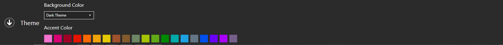

# Overview
Version 6 of the software underwent a major user interface (UI) redesign; this overhaul was to serve two functions:

1. **Update Technology:** Switching from ```WinForms``` to ```WPF``` allows for amazing functionality increases, such as the ability to use data binding to update displayed information in real time with greater ease
2. **User Experience Enhancement:** The larger of the two goals, v6.x is designed to place everything you need right at your fingertips as you need it.  Instead of opening a separate window to check your settings, you can easily glance over and modify them without leaving the main area of the application

To get started learning the software, please continue reading or select from the table of contents below; as new features are added, this page will be updated accordingly.

## Table of Contents

* [Window Components](#window-components)
* [Changing the Theme](#changing-the-theme)
* [Parsing Files](#parsing-files)
  * [Setting Parsing Options](#setting-parsing-options)
  * [Importing Files](#importing-files)
  * [Generating Reports](#generating-reports)
* [Using Mitigations](#using-mitigations)
  * [Adding New Mitigations](#adding-mitigations)
  * [Importing Mitigations](#importing-mitigations)
  * [Updating Mitigations](#updating-mitigations)
  * [Deleting Mitigations](#deleting-mitigations)

## Window Components
If you are new to the application, please take a few moments to become acquainted with its current structure, as shown and detailed below:
  

1. **Page Selector:** A tab control that allows you to navigate amongst the various features of Vulnerator:
  * **Reporting:** The main feature of the application, this tab contains all of the controls related to parsing vulnerability files and creating human-readable reports from them.  This tab is the main splash page for the application
  * **Mitigations:** The page containing the graphical interface for creating and maintaining reusable mitigations for ongoing vulnerabilities
  * **Vulnerability Glance:** This tab provides a quick insight into the results of the most recently parsed vulnerabilities.  This tab contains additional reporting functionality surrounding IAVMs, and is currently under construction
  * **Asset Contacts:** Another feature currently in the development process, this is designed to allow users to quickly and efficiently build a listing of customers for each individual system as well as user-defined groups of systems. Once created, these lists will be able to be used to generate emails to contacts informing them of current vulnerabilities that fall under their area or responsibility
2. **Reporting Options Pane:** This is the main control hub of the application; it is within this pane that you will provide the parameters regarding the report(s) that you want to construct as well as the raw vulnerability files to be parsed.  This area also contains the "Execute" file for vulnerability parsing
3. **File Listing:** A grid showing the current listing of files to be parsed, their type, and their current status
4. **Window Controls:** Similar to other Windows applications, these controls affect the positioning of the window (full screen, partial screen, minimized, and closed); take note that closing the window also exits the application
5. **Flyout Command Buttons:** These buttons will launch "flyout" windows that allow you to either view additional information about the program or customize the program to your liking, depending on which link is selected:
  * **News:** As of v6.1.1, Vulnerator now self reports on issues and releases posted on the project's GitHub site.  Should you ever come across a bug or question the currency of the release you are using, this is a hub of information to which you can turn
  * **About:** Here, you can find information about the application such as the version you are running as well as contact details for the creator and links to pertinent sites
  * **Theme:** If you are going to look at a computer screen for any amount of time, it might as well be something you'd like to look at.  Here, you have the ability do decide between a light or dark theme as well as an accent color of your choice
6. **Status Bar:** It is within this pane that you can check to verify the status of the activity you have performed - application progress and basic error reporting are noted here
7. **File Counter:** As the name implies, this is where you can quickly check to make sure that all of the files you intend to parse are accounted for

## Changing the Theme
To begin the process of changing the theme, click the "theme" link in the title bar, as noted above; this will launch the following flyout control:
  

Within this pane, select either a "light" or "dark" base theme as well as any of the accent colors provided; hovering over the accent square will provide a pop-up with the color's name.

## Parsing Files
As the main feature of Vulnerator, parsing vulnerability files and reporting from them takes center stage within the application.

### Setting Parsing Options
Begin by selecting what information you would like to see in the reports to be generated as well as the report types themselves:

  * **System Package Type:** Selecting DIACAP or RMF will alter what control information is imported from STIG checklists and SCAP output
  * **Severity:** Filters out any vulnerabilities matching the options that are not checked (e.g. to remove "Informational" findings, deselect the "Informational" and "CAT IV" checkboxes)
    * _Note:_ With regards to ACAS findings, severity is first determined by the "STIG Severity" provided by Tenable, if available.  If no "STIG Severity" is provided for the plugin, the Tenable-assigned severity is then utilized.  The mapping for Tenable severity to STIG Severity is as follows:
	  * Critical / High : CAT I
	  * Medium : CAT II
	  * Low : CAT III
	  * Informational : CAT IV
  * **Output Format:** Select which reports are required per your needs:
    * **POA&M / RAR:** eMASS-importable Plan of Action and Milestones and RMF Risk Assessment Report
	* **Discrepancies:** Identifies inconsistencies between STIG checklist files and SCAP outputs for like systems
	* **Asset Overview:** Provides quick insight into the number of ongoing findings on a system-by-system and file-by-file basis as well as which user-assigned group the system belongs to and its operating system, if available.  For ACAS output, verification of whether or not the scan was credentialed is also provided, indicating whether or not the asset failed for plugins 21745 and 26917
	  * _Note:_ A planned feature for the application is to also report on SCAP Score for each individual SCAP output, if it is available; expect to see this in a later release of the software
	* **PDF Summary:** Currently a work in progress, this output will become a "30,000 foot" overview of the parsed scan results.  Intended for upper-level management, this feature has not yet been fully conceptualized - if you have any input, please feel free to drop us a note on the [Issues](https://github.com/Vulnerator/Vulnerator/issues) page
	* **STIG Details & Review:** A report containing a wealth of STIG information, including all user-provided input (i.e. "Finding Details" and "Comments") along with fields designed to assist analysts with the review process ("Review Status" and "Notes")
	* **ACAS Scan Output:** Similar to the "STIG Details & Review" report, this spreadsheet will allow the user to quickly and easily review Nessus scan results.  It is worth noting that although the report will populate some fields from a CSV report, the best "bang for your buck" comes from importing *.nessus files whenever possible
	* **OS & User Breakdown:** Another work in progress, this report will allow the user to quickly identify asset operating system counts, vulnerabilities associated with each, and user account information, such as privilege level and asset acess
  * **Report Breakdown:** A planned feature, this will allow the user to further group reported information to suit their needs
  * **System Identifier to Report:** This allows the user to set a primary asset identifier (either IP Address or Host Name); whichever selection the user makes, the opposite item will be used as a "fallback" value if the primary is not available
  * **STIG Mitigation Text Location:** Due to discrepancies in where System Administrators (SAs) provide their feedback during STIG checklist creation, users now have the ability to choose which field to utilize for mitigation text.  If your SAs always provide input via the "Comments" or "Finding Details" fields, feel free to select one or the other.  Alternatively, if you are not sure which field will be used, feel free to select both
  * **Group Findings:** This directs Vulnerator to either put all assets affected by a vulnerability on one line or to place each asset as its own, separate vulnerability
    * _Note:_ This grouping only occurs on the POA&M and RAR reports; the "STIG Details & Review", "ACAS Scan Output", "Asset Overview", and "Discrepancies" reports will always place each asset on their own line
  * **eMASS POC Information:** By providing the user information associated with an account within eMASS, the "Office/Org" column of the "POA&M" will be pre-populated for all findings prior to input, as will the "POC Information" section of the RAR

### Importing Files
Once reporting options have been set, the user can then import all required files using the provided import buttons - each button will launch an "Open File" Dialog that is pre-filtered to only allow the file types for that kind of report

  * As files are imported, they can be viewed in the "Files to be Processed" pane; additionally, a "File Count" indicator is provided, for convenience
  * Users can provide a "Group Name" for files either globally or on a per-file basis; this group name will be utilized to associate mitigation statements from the user-populated library back to the correct vulnerabilities and assets

### Generating Reports
Once all of the raw data files have been imported, the user can begin parsing via the "Execute" button.  Following launch, all user options will become disabled until the application is finished the task; users can monitor status via the "Files to be Processed" pane as well as the status bar in the lower right-hand corner.  After parsing is completed, users can either clear all files to begin again using the "Clear Files" button, remove individual files by selecting them in the "Files to be Processed" pane and pressingthe "Delete" key on the keyboard, or add additional files and relaunch parsing via the "Execute" button

## Using Mitigations
Althoug the functionality disappeared in version 5 of the software (sorry!), v6 brought back the extremely handy mitigations library, adding to it via the use of a graphical user interface (GUI).  This functionality can be acessed by selecting the "Mitigations" tab at the top of the screen.

### Adding New Mitigations
On the mitigations tab, select the "Add" sub tab to create new mitigation items; on this page:

1. **Select a "Database Location":** This field is pre-populated with the database created at run-time.  If you'd like to create a new database, simply select a new location (or, alternatively, browse to an existing file).  Databases can be stored on fileshares, allowing access by multiple teammates
2. **Provide a "Vulnerability ID Number":** Individual IDs can be provided or multiple, similar IDs can be input, each on its own line.  ACAS plugins are should be entered via their "Plugin ID", STIGs / SCAP checks via their "V-ID" (e.g. "V-1003"), and WASSP findings via their "W" ID (e.g. "W7.01")
3. **Enter "Vulnerability Text":** This is the actual mitigation text that you would like saved and utilized in future reporting
4. **Denote a "Vulnerability Status":** Options are "Ongoing", "Completed", and "False Positive"
5. **Generate / Select a "Mitigation Group":** This is the identifier used to tie your mitigation back to the appropriate asset; some group name examples are:
  * **Operating System Name:** "Windows Assets"
  * **Accreditation Name / Number:** "Patuxent River Data Center", "eMASS 624"
  * **Project Name:** "Navy ERP"
  * **Network Name:** "NMCI", "DREN"
    * _Note:_ The "MAC Level" field is currently required, but will be removed at a later date - feel free to select a "filler" value
6. **Select "Save Mitigations":** A new mitigation item will be created in the "Existing Statements" pane, and the "Mitigations Count" field will increment accordingly

### Importing Mitigations
Should an existing "Mitigations.txt" file be on-hand from a prior version of Vulnerator (and still relevant), users can easily import this into the latest release:

1. **Select the "Import Mitigations" Button:** This will launch the "Import" Flyout Controls
2. **Select the File to be Uploaded:** Browse to and find the appropriate file (the "Open File" dialog is pre-filtered for "*.txt" files)
3. **Provide Supporting Details:** Similar to adding new mitigations, provide group information as well as a status to be applied

Once the above steps are completed, click the "Import" button to finalize the process.

### Updating Mitigations
Given their continually changing nature, version 6 of the software has been designed to allow the user to quickly and easily modify the mitigations, as neccessary:

1. Select the "Update" sub tab
2. Select an existing mitigation from the "Existing Statements" pane
3. Make any required modifications in the "Modify Entry" pane to the left
4. Click "Update Mitigation"

To verify that the update was successful, simply re-select the item from the "Existing Statements pane"

### Deleting Mitigations
Once expired, mitigations can easily be removed from the list with a few clicks of a mouse:

1. From either the "Add" or "Update" sub tab check the boxes for the mitigations to be deleted; alternatively, you can select all of the mitigations by clicking the checkbox in the "Select" column header
2. Delete the mitigations using the "Delete Mitigations" button below the data grid; you can also uncheck all boxes by clicking "Clear Selection"
  * _Note:_ Deletions are permanent!  Make sure that what you are deleting is correct!